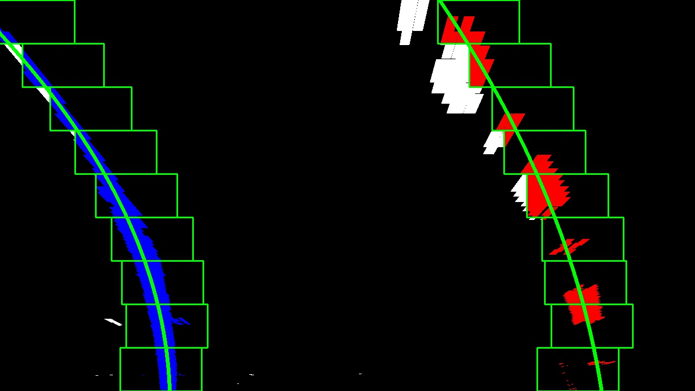

**Advanced Lane Finding Project**

The goals / steps of this project are the following:

* Compute the camera calibration matrix and distortion coefficients given a set of chessboard images.
* Apply a distortion correction to raw images.
* Use color transforms, gradients, etc., to create a thresholded binary image.
* Apply a perspective transform to rectify binary image ("birds-eye view").
* Detect lane pixels and fit to find the lane boundary.
* Determine the curvature of the lane and vehicle position with respect to center.
* Warp the detected lane boundaries back onto the original image.
* Output visual display of the lane boundaries and numerical estimation of lane curvature and vehicle position.

[//]: # (Image References)

[image1]: ./examples/undistort_output.png "Undistorted"
[image2]: ./test_images/test1.jpg "Road Transformed"
[image3]: ./examples/binary_combo_example.jpg "Binary Example"
[image4]: ./examples/warped_straight_lines.jpg "Warp Example"
[image5]: ./examples/color_fit_lines.jpg "Fit Visual"
[image6]: ./examples/example_output.jpg "Output"
[video1]: ./project_video.mp4 "Video"

## [Rubric](https://review.udacity.com/#!/rubrics/571/view) Points
### Here I will consider the rubric points individually and describe how I addressed each point in my implementation.  

---
### Writeup / README

### Explanation of Python Source Files
* `prog4-cal.py` -  The code does the camera calibration and saves the mtx and dist coefficients to and pickle file called "cal_pickle.p"
* `proj4.py` - The main code that loads the above pickle file and does the main functions.
* `proj4_video_gen.py` -  This is and altered version of `proj4.py` code that can run the code over a given video.
* `lane_locator.py` - This is class used by both `proj4.py` and `proj4_video_gen.py`

### Camera Calibration

#### 1. Computation of the Camera Matrix and Distortion Coefficients

The code for this step is contained in lines #15 through #47 of the file called `proj4-cal.py`).  
I start by preparing "object points", which will be the (x, y, z) coordinates of the 9x6 chessboard corners in the real world. Here I am assuming the chessboard is fixed on the (x, y) plane at z=0, such that the object points are the same for each calibration image.  Thus, `objp` is just a replicated array of coordinates, and `objpoints` will be appended with a copy of it every time I successfully detect all chessboard corners in a test image.  `imgpoints` will be appended with the (x, y) pixel position of each of the corners in the image plane with each successful chessboard detection.  

I then used the output `objpoints` and `imgpoints` to compute the camera calibration and distortion coefficients using the `cv2.calibrateCamera()` function.  I then saved the mtx and dist coefficeints to a pickle file because this only needs to be done once.

### Pipeline (single images)

#### 1. Below is an example of a distortion-corrected image.

Here is the original test image...


After loading the mtx and dist distortion coefficients from the camera calibration pickle file and applying `cv2.undistort()` function to the test image I obtained the following result:

Notice the white car to the right of the image to see the effect.  This was accomplished in lines #33 and #137 of the code in file `proj4.py` 
 
#### 2. Use of color transforms and gradients to create a thresholded binary image.  
I used a combination of color and gradient thresholds to generate a binary image (thresholding steps at lines #121 through #128 in `proj4_video_gen.py`).  I tried increasing the kernel size to 5x5 and 9x9 for the gradients which did smooth out the lines but also made the lines wider which gave me too many false positives when detecting lines so I reverted back to the 3x3 kernal.  Keeping high thresholds captured more line data thus helping to detect lines later in the code.  Here's output of one of the test images. I also used a color threshold on the combination of HLS and HSV color spaces based on the saturation (HLS) and the value (HSV).  Finally all binaries were combined in lines #156 through #158 in `proj4_video_gen.py` to get the following final binary image. 


#### 3. Perspective Transformation

The code for my perspective transform appears in lines 139 through 160 in the file `proj4_video_gen.py`.  The code takes an image (`img`), as well as source (`src`) and destination (`dst`) points.  I chose to hardcode the source and destination points in the following manner:

```
    src = np.float32([[610,440], 
                     [670,440],
                     [1042,675],
                     [285,675]])
    
    xoffset = 250 #x offset for dst points                          
    yoffset = -100 #y offset for dst points
    img_size = (img.shape[1], img.shape[0])    
        
    dst = np.float32([[xoffset, yoffset], 
                      [img_size[0]-xoffset, yoffset], 
                      [img_size[0]-xoffset, img_size[1]], 
                      [xoffset, img_size[1]]])

```
This resulted in the following source and destination points:

| Source        | Destination   | 
|:-------------:|:-------------:| 
| 610, 440      | 250, -100     | 
| 670, 440      | 1030, -100    |
| 1042, 675     | 1030, 720     |
| 285, 675      | 250, 720      |

I verified that my perspective transform was working as expected by drawing the `src` and `dst` points onto a test image and its warped counterpart to verify that the lines appear parallel in the warped image.  Using -100 for the upper y value of the trapezoid had the effect of stretching the transform higher thus eliminating some of the noise that was above the lane in some of the test images.

Before perspective transform...


After perspective transform...


#### 4. Location of Lane-Line Pixels

I created a class called lane_line_finder in `lane_locator.py` to first do a histogram of the bottom half of the perspective binary image to find a starting location of the lanes at the bottom of the image. The class is instatiated on line 264 and called on line 165 of `proj4_video_gen.py`. The class code uses nine sliding windows (one for each vertical level of the perspective image) to locate the line in each of the levels of the image.  The windows slide based on the mean values of the pixels in the window.  A window for each lane is determined by first finding the center point and then using a given margin and the height of the image diveded by the number of windows (in this case, 9).  The right lane tends to have missing lines because they tend to be dashed in the test data. Because of this bias, if the right lane windows has no pixels in the window, the right lane center point will "bump" in the same direction of the previous window. See image below...



The x and y points found by the lane_locator class were fitted to numpy polylines from which a green colored trapezoidal polygon was created and is done on lines 169 through 202 of `proj4_video_gen.py`.  Finally, the perspective trapezoidal image was inverse transformed back to the original perspective and overlayed upon the original image.

The radius of curvature and position of the vehicle with respect to center was done in lines #215 through #247 in my code in `proj4_video_gen.py` and overlayed onto the final image using cv2.

Here is an example of my result on a test image:


### Pipeline (video) `marked_video.mp4`

Here's a [link to my video result](marked_video.mp4) 


### Discussion of Issues

I mainly used several techniques that were done in the class lessons.  I played around with various gradients and found that using the highest thresholded intensity values (like 150 to 255) worked best.  Also, using the HLS and HSV color spaces really improved the binay line images.

At first I had difficulty transforming the perspective to get the lane lines without too much noise.  I am surprised at how much this effects the results of the entire project.  After transforming closer to the sides and stretching the length I got the desired result.  

The code is somewhat biased towards using the left hand lane to determine what to do with the right hand lane if no data is present in the window. More work would need to be done to make it work well on roads without a solid left lane line marker.  I never did look in to using convolution to detect the lanes which may have resolved some issues.  I also should have done an averaging technique on lines in previous frames to make it more robust.


