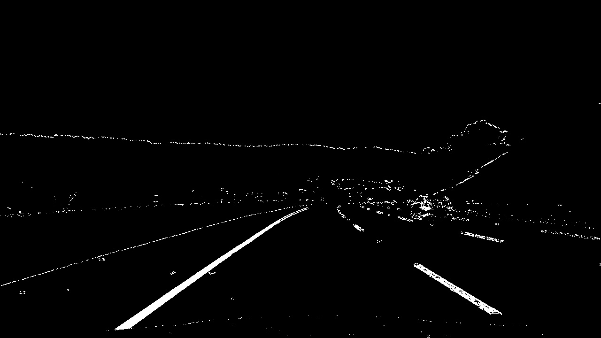
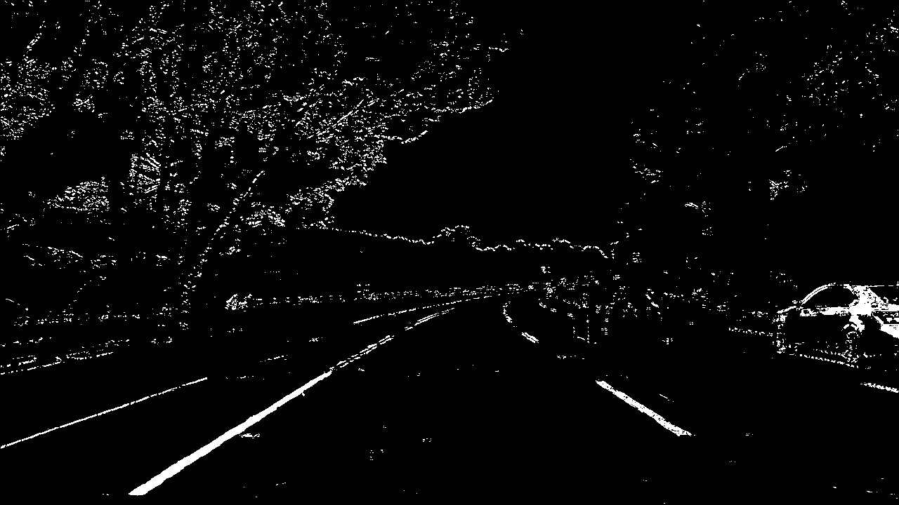

**Advanced Lane Finding Project**

The goals / steps of this project are the following:

* Compute the camera calibration matrix and distortion coefficients given a set of chessboard images.
* Apply a distortion correction to raw images.
* Use color transforms, gradients, etc., to create a thresholded binary image.
* Apply a perspective transform to rectify binary image ("birds-eye view").
* Detect lane pixels and fit to find the lane boundary.
* Determine the curvature of the lane and vehicle position with respect to center.
* Warp the detected lane boundaries back onto the original image.
* Output visual display of the lane boundaries and numerical estimation of lane curvature and vehicle position.

[//]: # (Image References)

[image1]: ./examples/undistort_output.png "Undistorted"
[image2]: ./test_images/test1.jpg "Road Transformed"
[image3]: ./examples/binary_combo_example.jpg "Binary Example"
[image4]: ./examples/warped_straight_lines.jpg "Warp Example"
[image5]: ./examples/color_fit_lines.jpg "Fit Visual"
[image6]: ./examples/example_output.jpg "Output"
[video1]: ./project_video.mp4 "Video"

## [Rubric](https://review.udacity.com/#!/rubrics/571/view) Points
###Here I will consider the rubric points individually and describe how I addressed each point in my implementation.  

---
###Writeup / README

###Camera Calibration

####1. Briefly state how you computed the camera matrix and distortion coefficients. Provide an example of a distortion corrected calibration image.

The code for this step is contained in lines #15 through #47 of the file called `proj4-cal.py`).  

I start by preparing "object points", which will be the (x, y, z) coordinates of the 9x6 chessboard corners in the world. Here I am assuming the chessboard is fixed on the (x, y) plane at z=0, such that the object points are the same for each calibration image.  Thus, `objp` is just a replicated array of coordinates, and `objpoints` will be appended with a copy of it every time I successfully detect all chessboard corners in a test image.  `imgpoints` will be appended with the (x, y) pixel position of each of the corners in the image plane with each successful chessboard detection.  

I then used the output `objpoints` and `imgpoints` to compute the camera calibration and distortion coefficients using the `cv2.calibrateCamera()` function.  I then saved the mtx and dist coefficeints to a pickle file because this only needs to be done once.


###Pipeline (single images)

####1. Below is an example of a distortion-corrected image.
To demonstrate this step, I will describe how I apply the distortion correction to one of the test images like this one:


After loading the mtx and dist distortion coefficients from the pickle file and applying `cv2.undistort()` function to the test image I obtained the following result:


 Notice the white car to the right of the image to see the effect.  This was accomplished in lines #33 and #137 of the code in file proj4.py 
 
####2. Use of color transforms and gradients to create a thresholded binary image.  
I used a combination of color and gradient thresholds to generate a binary image (thresholding steps at lines #121 through #128 in `proj4_video_gen.py`).  I tried increasing the kernel size to 5x5 and 9x9 for the gradients which did smooth out the lines but also made the lines wider which gave me too many false positives when detecting lines so I reverted back to the 3x3 kernal.  Keeping high thresholds captured more line data thus helping to detect lines later in the code.  Here's output of one of the test images. I also used a color threshold on the combination of HLS and HSV color spaces based on the saturation (HLS) and the value (HSV).  Finally all binaries were combined in lines #156 through #158 in `proj4_video_gen.py` to get the following final binary image. 



####3. Perspective Transformation

The code for my perspective transform appears in lines 139 through 160 in the file `proj4_video_gen.py`.  The code takes an image (`img`), as well as source (`src`) and destination (`dst`) points.  I chose to hardcode the source and destination points in the following manner:

```
    src = np.float32([[610,440], 
                     [670,440],
                     [1042,675],
                     [285,675]])
    
    xoffset = 250 #x offset for dst points                          
    yoffset = -100 #y offset for dst points
    img_size = (img.shape[1], img.shape[0])    
        
    dst = np.float32([[xoffset, yoffset], 
                      [img_size[0]-xoffset, yoffset], 
                      [img_size[0]-xoffset, img_size[1]], 
                      [xoffset, img_size[1]]])

```
This resulted in the following source and destination points:

| Source        | Destination   | 
|:-------------:|:-------------:| 
| 610, 440      | 250, -100     | 
| 670, 440      | 1030, -100    |
| 1042, 675     | 1030, 720     |
| 285, 675      | 250, 720      |

I verified that my perspective transform was working as expected by drawing the `src` and `dst` points onto a test image and its warped counterpart to verify that the lines appear parallel in the warped image.  Using -100 for the upper y value of the trapezoid had the effect of stretching the transform higher thus eliminating some of the noise that was above the lane in some of the test images.

Before perspective transform...


After perspective transform...


####4. Describe how (and identify where in your code) you identified lane-line pixels and fit their positions with a polynomial?

Then I did some other stuff and fit my lane lines with a 2nd order polynomial kinda like this:

![alt text][image5]

####5. Describe how (and identify where in your code) you calculated the radius of curvature of the lane and the position of the vehicle with respect to center.

I did this in lines # through # in my code in `my_other_file.py`

####6. Provide an example image of your result plotted back down onto the road such that the lane area is identified clearly.

I implemented this step in lines # through # in my code in `yet_another_file.py` in the function `map_lane()`.  Here is an example of my result on a test image:

![alt text][image6]

---

###Pipeline (video)

####1. Provide a link to your final video output.  Your pipeline should perform reasonably well on the entire project video (wobbly lines are ok but no catastrophic failures that would cause the car to drive off the road!).

Here's a [link to my video result](./project_video.mp4)

---

###Discussion

####1. Briefly discuss any problems / issues you faced in your implementation of this project.  Where will your pipeline likely fail?  What could you do to make it more robust?

Here I'll talk about the approach I took, what techniques I used, what worked and why, where the pipeline might fail and how I might improve it if I were going to pursue this project further.  

